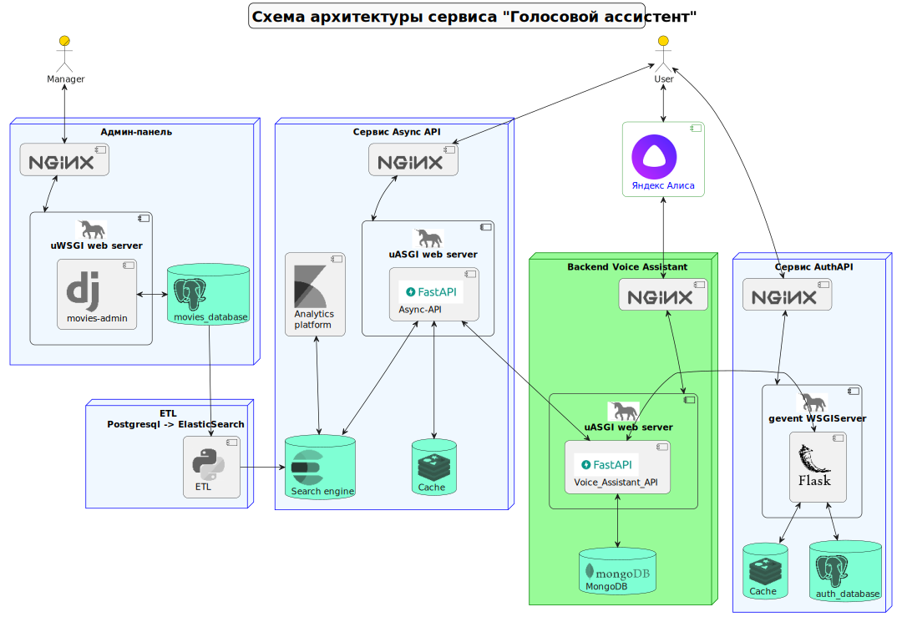
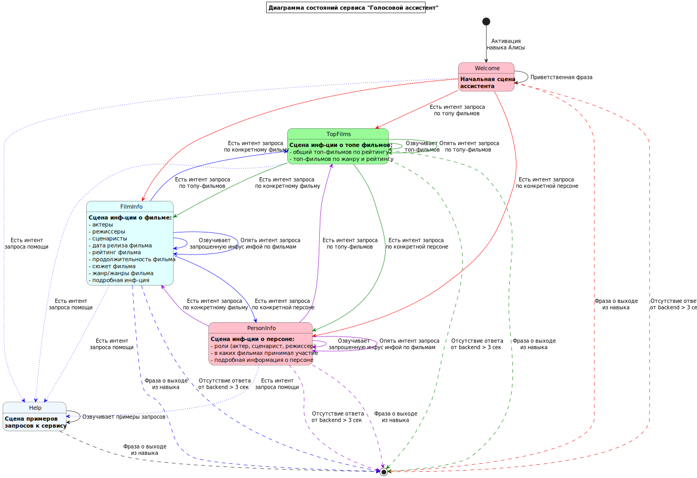

Сервис"Голосовой помощник"

## Схема архитектуры сервиса

Backend сервиса голосового помощника реализован на FastAPI.
В качестве сервиса обработки естественного языка и выявления намерений, интентов (intents) пользователя, а также 
frontend для взаимодействия с пользователем применяется навык Яндекс Диалогов, настроенный на обработку интентов.
Почему Яндекс Диалоги - потому что функциональность создания скриптов для обработки NLU для выявления интентов 
реализована непосредственно в навыке и нет необходимости прибегать к конструкторам вроде Aimylogic, как в случае 
голосового ассистента Маруся от VK.
Для сохранения запросов и ответов сервиса с целью их последующего анализа используется MongoDB. Сохраненные данные могут
быть проанализированы, например, для выявления необработанных запросов и доработки по результатам их анализа сервиса/
навыка для лучшего выявления интентов в запросах пользователей. Или использоваться совместно с информацией UGC сервиса.

## Описание сервиса голосового помощника
Сервис обрабатывает webhook-запросы навыка Яндекс Диалоги (Алисы).
Логика обработки естественного языка и формирования интентов в результате взаимодействия пользователя с навыком 
реализуется на стороне Яндекс Диалогов.
При каждом обращении к навыку Яндекс Диалоги отправляют POST-запрос на Backend сервиса. Формат запроса навыка описан в 
[документации](https://yandex.ru/dev/dialogs/alice/doc/request.html).
Логика обработки Backend сервиса запроса Яндекс Диалогов реализована в зависимости от состояния (сцены) и 
переданного интента. За основу был взят [пример](https://github.com/yandex/alice-skills/tree/master/python/scenes) 
реализации backend для Яндекс Диалогов на основе сцен.
Фактически Backend сервиса реализует паттерн **машина состояний** (**state machine**).
Состояния и некоторые переходы между ними изображены на схеме:

Есть пять основных сцен:
1. Начальная сцена (Welcome) - на которую пользователь попадает при старте навыка.
2. Сцена информации о топе фильмов (TopFilms) - на нее пользователь попадает при запросе о лучших фильмов по рейтингу или
лучших фильмов в каком-то жанре
3. Сцена информации о фильме (FilmInfo) - на нее пользователь попадает при запросе информации по конкретному фильму.
4. Сцена информации о персоне (PersonInfo) - на нее пользователь попадает при запросе информации по конкретной персоне.
5. Сцена помощи (Helper) - на нее пользователь перенаправляется при запросе помощи по работе с навыком.

После запуска навыка пользователь попадает на начальную сцену, на которой навык приветствует пользователя и рассказывает 
о себе. После чего ожидает запроса пользователя. Обработав запрос пользователя, навык выявляет в запросе пользователя 
интенты, описанный в настройках навыка, и отправляет webhook запрос на Backend сервиса. Если в запросе есть интент, 
соответствующий одной из сцен, то осуществляется переход на эту сцену, обработка запроса соответствующим методом класса 
сцены и возврат ответа навыку. 

При формировании ответа, при необходимости сохранения информации, которая должна быть возвращена в следующем запросе в 
рамках сессии с пользователем, эта информация сохраняется в переменной session_state словаря ответа.

Для сцены TopFilms в ней сохраняются значение текущей страницы результатов, максимальная страница для результатов 
и текущий интент для обеспечения возможности навигации пользователя Вперед/Назад по страницам результатов.

Для сцен FilmInfo и PersonInfo в ней сохраняются значения film_id и person_id соответственно для исключения лишних 
запросов к ES если пользователь продолжает взаимодействовать с голосовым помощником в рамках информации по тому же 
фильму или персоне.

Помимо этого переменной session_state сохраняются имя текущей сцены для идентификации последней сцены и последняя фраза 
навыка для реализации просьбы повторить ответ.

## Запуск сервисов

1. Переименовать файлы .env.sample в .env в каталогах async-api, auth-api, voice_assistant_api. Уточнить при необходимости 
значения переменных окружения.
2. Распаковать [архив базы данных](./async-api/data.rar) в папку ./async-api/data. Архив содержит базу данных фильмов, 
дополненную полями на русском языке и дополнительной информацией по фильмам.
3. Запустить docker-compose в корневом каталоге проекта командой:
```shell
docker-compose up --build -d
```


